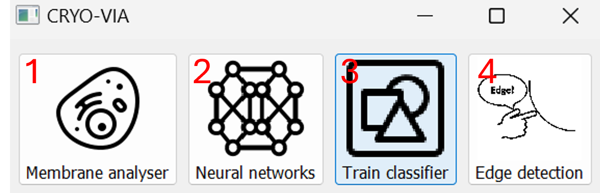
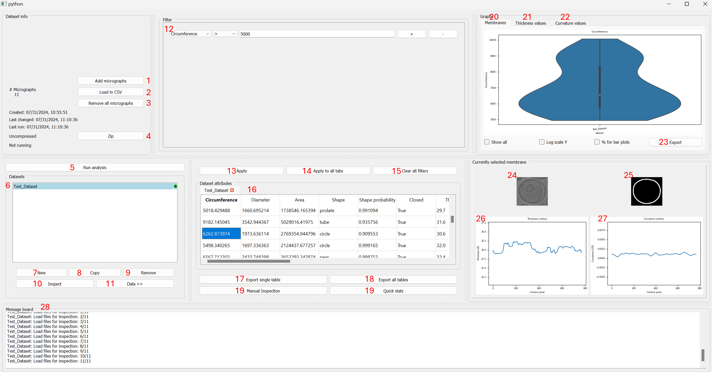
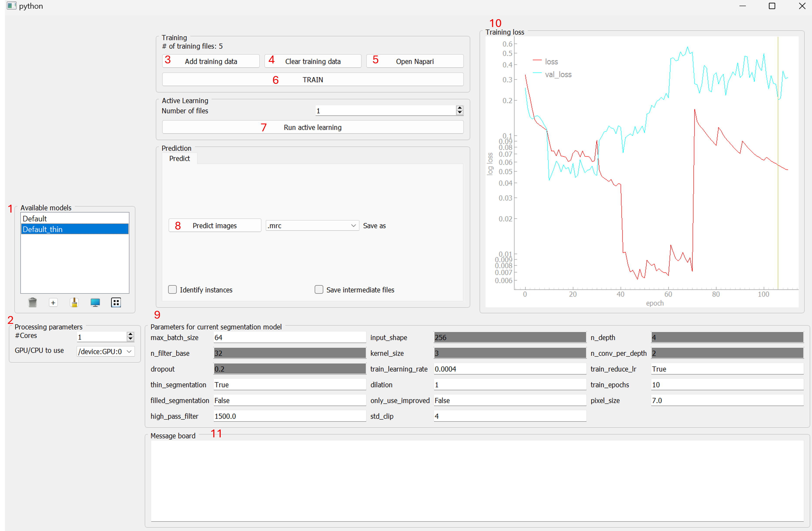
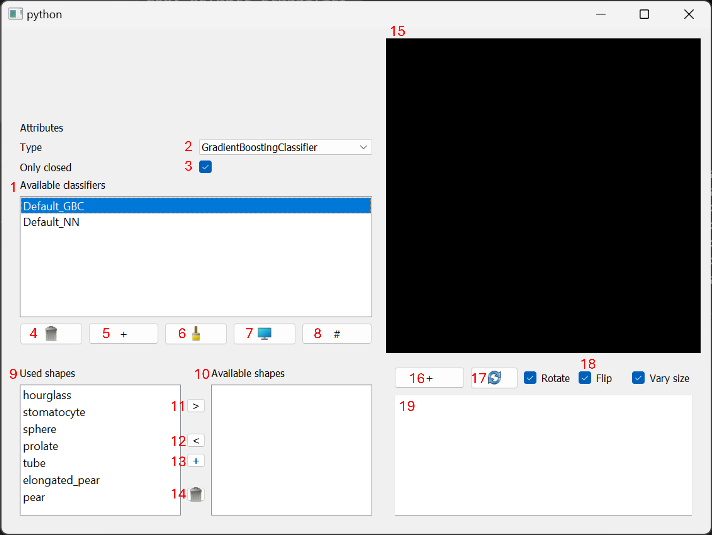
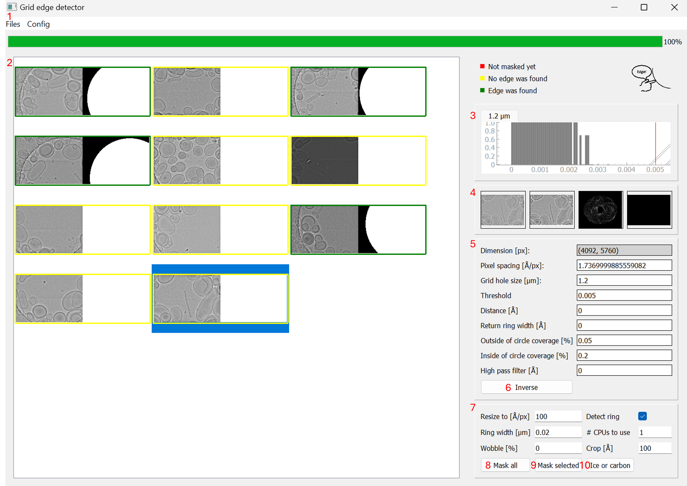
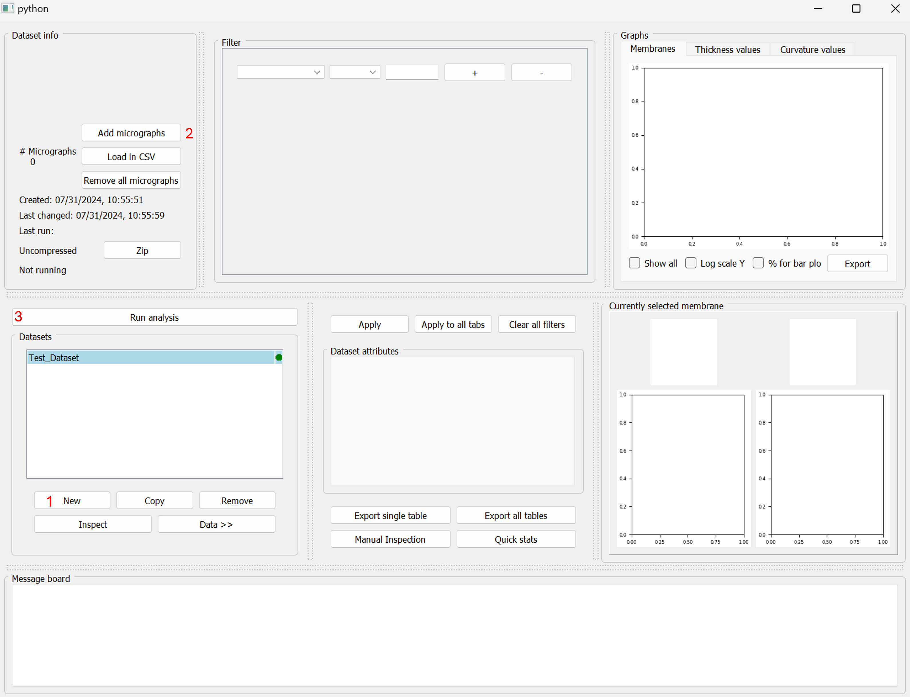
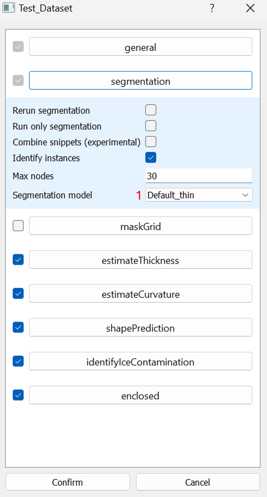
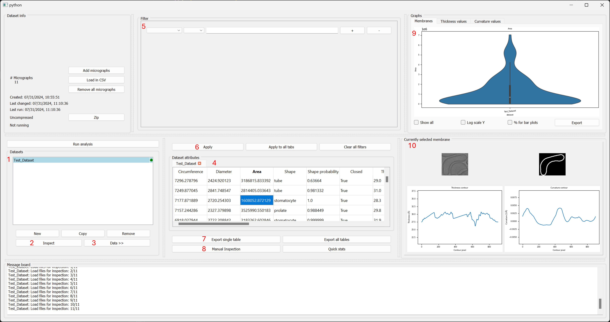
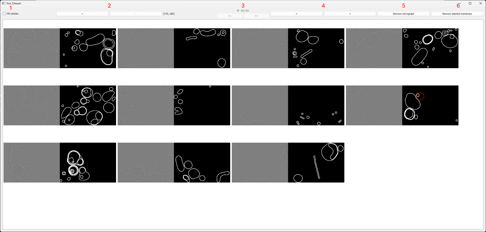
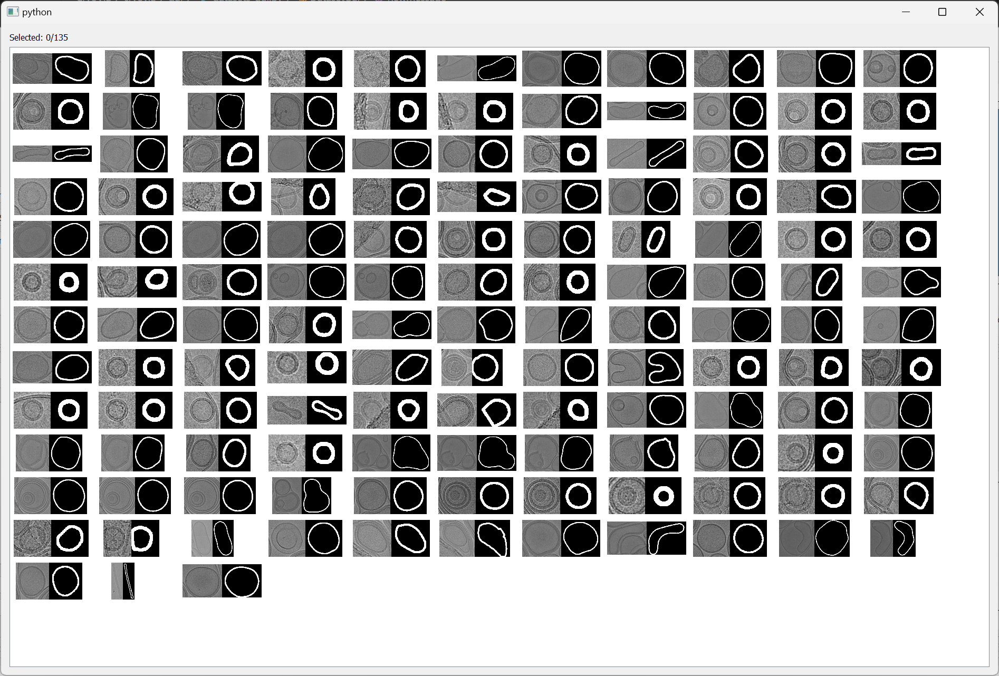

# Guide on how to use CryoVia

## Installation

See [README](README.md)

[1. General Usage](#general-usage)

 
 [&nbsp; &nbsp; 1.1 Starting CryoVia](#starting-cryovia)

 [&nbsp; &nbsp; 1.2 Membrane analyser](#membrane-analyser)
 
 [&nbsp; &nbsp; 1.3 Neural network](#neural-network)

[&nbsp; &nbsp; 1.4 Shape classifier](#shape-classifier)

[2. Example dataset](#example-dataset)

[&nbsp; &nbsp; 2.1 Dataset creation and running analysis](#dataset-creation-and-running-analysis)

[&nbsp; &nbsp; 2.2 Data extraction ana analysis](#data-extraction-and-analysis)

[&nbsp; &nbsp; 2.3 Micrograph inspection](#micrograph-inspection)

[&nbsp; &nbsp; 2.4 Vesicle inspection](#vesicle-inspection)


## General Usage

### Starting CryoVia
Activate the conda environment:

```conda activate cryovia```

Start CryoVia:
```cryovia```
Optional parameters:
```--njobs 5```
```--gpus 0,1```

You will see the starting menu of CryoVia:



1. Membrane analyser: The main part of CryoVia. Here you can create Datasets, run analysis and analyse the resulting Data.
2. Neural networks: Here you can create new neural networks, train neural networks or modify them. It also provides methods for manual segmentations.
3. Train classifier: Here you can create, modify and train shape classifiers. It also provides methods to creating new shapes for training.
4. Edge detection: Here you can detect grid holes in micrographs. You can also import CryoVia datasets and remove all membranes found outside of the grid holes.

### Membrane analyser



1. Add micrographs: Opens a file explorer to select micrograph files to add to the currently selected dataset (in 6.)
2. Load in CSV: Opens a file explorer to select a csv file to load in micrographs and optionally segmentions as well to the currently selected dataset. The path to the micrographs should be in the first column and the options path to the segmentations in the second
3. Remove all micrographs: Removes all micrographs of the currently selected dataset.
4. Zip/Unzip: Zips or unzips the dataset. Reduces the file size and number of files needed for this dataset. Running analysis or modifying this dataset needs this dataset to be unzipped.
5. Run analysis: Will open up a parameter window to run segmentation and various analysis on the membranes found in the micrographs.
6. A list of all available datasets
7. New: Opens up a file explorer to selected where the new dataset will be saved and then creates a new dataset.
8. Copy: Create a copy of the currently selected dataset. All needed data will be copied. Can take some time for large datasets.
9. Remove: Removes the currently selected dataset with all its data. Cannot be reveresed.
10. Inspect: Opens a new window where the micrographs and their corresponding segmentation can be viewed. In this window individual membranes or micrographs can be removed from the dataset. See TODO
11. Data >>: Loads the data into the table view to analyse the data. Multiple different datasets can be loaded in at the same time to compare the results.
12. Filters: Here you can create filters to apply to the current loaded datasets. See image for an example. All numerical values are given in Å or 1/Å.
13. Apply: Applies the filters to the currently seen dataset data.
14. Apply to all tabs: Applies the filters to all loaded in data.
15. Clear all filters: Clears all create dfilters in 12
16. Data table view: All the extracted data from the analysis can be viewed here. Every dataset has its own tab. In each tab each found membrane has its own row and each column is a different extracted attribute. Rows can be removed by selection rows and pressing ```del``` on the keyboard. This will prompt to ask if it should be removed only temporarily or permanently.
17. Export single table: Exports the currently selected tab as a csv file.
18. Export all tables: Exports all currently selected tabs as a csv file. Will add the corresponding dataset as a column. 
19. Manual inspection: This will open a window where each cropped membrane will be shown as well as its segmentation. You can also delete membranes from the dataset using this window.
20. Membranes tab: Shows a graph for the currently selected attribute. If you select "Show all" it will add all dataset tabs to the graphs. 
21. Thickness values: Here you can load in all thickness values from every single pixel point for each dataset. Loading this will take some time.
22. Curvature values: Here you can load in all curvature values from every single pixel point for each dataset. Loading this will take some time.
23. Export: You can save the currently shown graph as a png file. You can also do this by right-clicking the graph.
24. Shows the cropped membrane structure from the currently selected row in the table view. You can right click this image to show the membrane in the complete micrograph, highlighted in red.
25. Shows the cropped membrane segmentation from the currently selected row in the table view.
26. Shows the bilayer thickness values along the membrane contour for the currently selected row in the table view.
27. Shows the curvature values along the membrane contour for the currently selected row in the table view.
28. Message board: CryoVia will print some information here during analysis and loading of data.

### Neural Network



1. Available models: A list of all available segmentation models. You can remove, create, copy, train and set the parameters with the bottom buttons. 
2. Processing parameters: You can set the number of usable parallel cores and which GPU to use during training and predicting.
3. Add training data: Adds training data to the currently selected model. Training data is micrograph and its segmentation. Opens two file explorers. In the first you have to select micrographs and in the second the corresponding segmentations. It should be the same amount of files. Both lists of files will be alphabetically sorted and each micrograph gets its segmentation. 
4. Clear training data: Removes all training data from the currently selected model.
5. Open napari: Opens napari to manually segment micrographs for the currently selected model. See TODO
6. TRAIN: Trains the currently selected model with all given training data and parameters.
7. Run active learning: Opens a file explorer to select micrographs. The currently selected model will predict the segmentation of the micrographs. The most unsure predicted micrographs will be selected and opened in napari for manual segmentation. The number of selected unsure micrographs can be set above.
8. Predict images: Opens a file explorer to select micrographs to predict with the currently selected model. Can be saved as various file formats. Identify instances can be set to solve overlapping membranes. Save intermediate files will not only save the last prediction but also some intermediate files.
9. All the parameters for the currently selected model. If a new model is created all parameters can be set. Once the model has been trained some of the parameters are locked in.
10. Training loss: The graph of validation loss and normal loss during training. All training cycles are shown as a contiuous graph.
11. Message board: CryoVia will print some information here during training and loading of data.

### Shape classifier



1. Available classifiers: A list of available classifier models.
2. Type: The model the classifier uses. It is either a Gradient boostin model or a small 1D-Convolutional neural network.
3. Only closed: Whether to only use closed vesicles. The classification is more precise using only closed vesicles but cannot predict non-closed vesicles.
4. Remove the currently selected classifier.
5. Create a new classifier.
6. Create a copy of the currently selected classifier.
7. Train the currently selected classifier.
8. Show the confusion matrix of the last training iteration of the currently selected classifier.
9. Used shapes: All the shapes used for training of the currently selected classifier.
10. Available shapes: All the shapes available and not used for training of the currently selected classifier.
11. Move shapes from the left to the right.
12. Move shapes from the right to the left.
13. Create a completly new shape object.
14. Remove this shape object.
15. Drawer window: Here you can draw new shapes. By pressing the "+" the curvature of these shapes will be calculated and added to the selected shape object. 
16. \+: The curvature of the currently drawn shape will be calculated and added to the selected shape object. Multiple variations of this shape will be created depending on which of "Rotate", "Flip" and "Vary size" are selected. 
17. Clear the drawing window.
18. Rotate: Create three variations of the drawn shape by rotating. Flip: Multiply the amount of variations by two by flipping them. Vary size: Create more variations by resizing the draw shape. Ideally these variations are not needed because of the normalization but using these leads to more consistent classification.
19. Message board: CryoVia will print some information here during training.



1. Files: You can load files, import CryoVia datasets, CryoSparc picking jobs, relion picking jobs and export as masks or fitting to the CryoVia, CroySparc or relion task.
2. The current status of the grid edge detection.
3. The histogram of the currently selected image of the found difference of mean inside and mean outside of the hole.
4. In order: The currently selected image, the used image for the calculation (with cropping, resizing, high pass filtering), the difference map, the found mask.
5. Parameters set for the currently selected image. Can be set for multiple images at the same time.
6. Inverse: Will inverse the mask of the currently selected image.
7. Parameters set for all images.  
8. Will mask all loaded images with the given parameters.
9. Will mask only the selected images with the given parameters.
10. Opens a window to differentiate between images containing only ice or only carbon by using the mean value of the images where no edge was found. Ideally a clear cut can be seen between these types of images.


## Example Dataset

We will show an example on how to navigate CryoVia with a small dataset of 11 images. They can be found in the "test_data" directory.

Activate the conda environment:

```conda activate cryovia```

Start CryoVia:
```cryovia```

### Dataset creation and running analysis
Now we want to create a dataset and let the segmentation and analysis run.



1. New: Create a new dataset. You have to choose where to save it. You can then rename it with a double click on the name.
2. Add micrographs: You have to add the micrographs you want to analyse to the dataset. Just select all the images found in "test_data".
3. Run analysis: Next, you want to run the segmentation and the analysis for the dataset. Clicking this will open a parameter window where you can choose various parameters and models.



4. We will keep almost all of the default parameters but we will change the segmentation model to use the model which was trained to predict very thin membranes because in the test dataset there are a few very close membranes and this helps to separate them more consistently.

Then we confirm the parameters, select how much parallelization we want to use and the rest is done by CryoVia.

### Data extraction and analysis

After running the segmentation and analysis you can look at the results.



1. Select the dataset we just ran the analysis on.
2. You can look at the segmentation results for each micrograph and remove unwanted micrographs or membranes. These results are already cleaned. So only completely segmented vesicles are beeing used. (See TODO)
3. To load in the results for the whole dataset click "Data >>" and it will load in the data about each vesicle into to table view in the middle.
4. In this table view every row represents a vesicle and the columns indicate their attributes. You can remove incorrectly segmented membranes with the ```del``` key. If you click on any column it will show you the results for the whole dataset in the graph at 9. You can also display all loaded in datasets by clicking "Show all".
5. You can filter the table in 4 by creating filters here.
6. After creating filter you have to apply these to the table view.
7. You can export the table as a csv file.
8. You can also have an overview of all membranes currently in the table. This will show each vesicle and its segmentation in a separate window. You can also delete membranes from the dataset in this window by selecting objects and pressing ```del```. See TODO
9. Here you will see graphs for the selected attributes for the whole dataset(s).
10. Here you will see individual information about the currently selected vesicle in the table.

### Micrograph inspection

Here you can inspect the segmentation of the micrographs, remove micrographs or specific membranes.

1. Fill vesicles: Changes the way the vesicles are represented. Can be easier to click specifc vesicles, but can be confusing when dealing with enclosed vesicles.
2. You can change the size of the shown images. Can also be done with ```CTRL + Mouse wheel```.
3. Only 100 images at a time are shown to not load all the data at once. Here you can change which one you want to see.
4. Will focus the next/previous membrane in the selected micrograph. Can be used to manually inspect membranes an remove them. You can also ```Right click``` on a membrane to focus it. You have to be precice though and zooming on often helps with this.
5. You can remove this micrograph from the dataset. This will be applied when closing this window.
6. You can remove this membrane from the dataset. This will be applied when closing this window.


### Vesicle inspection
Here you can inspect every single membrane/vesicle segmented from the current table. You can Zoom with ```CTRL + Mouse Wheel``` and remove selected membranes from the dataset with ```del```


